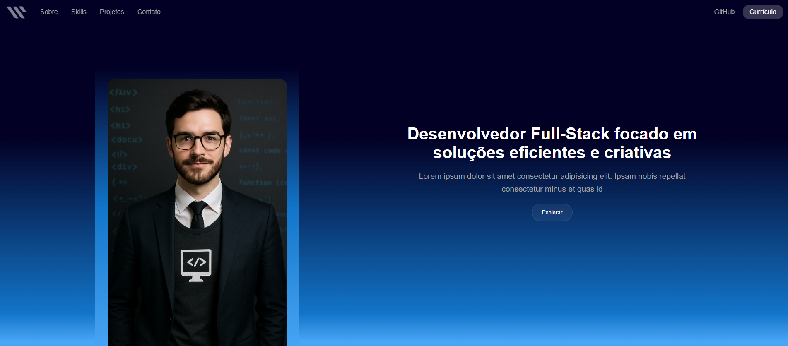
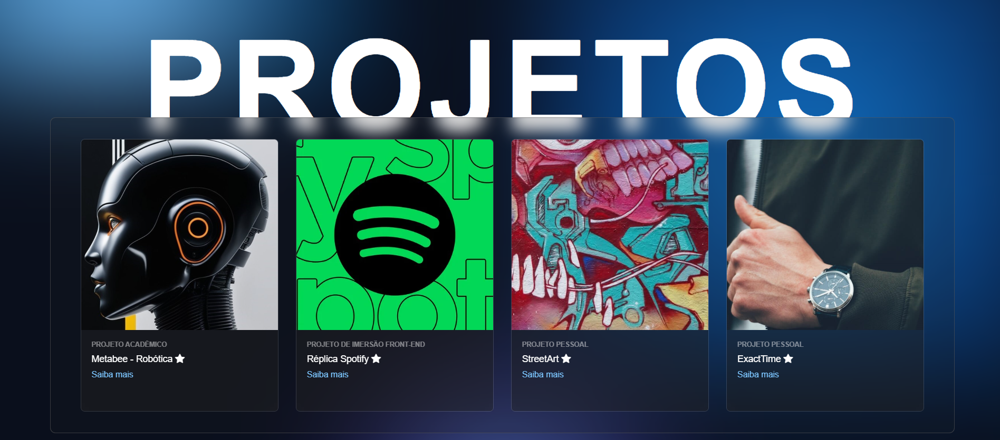
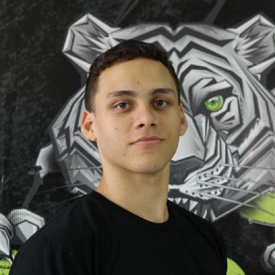
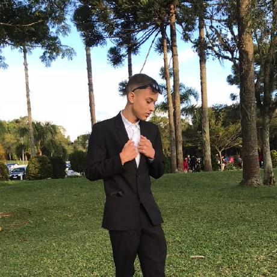

<h1 align="center" style="font-weight: bold;">Portfolio template 💻</h1>

<p align="center">
 <a href="#tech">Tecnologias</a> • 
 <a href="#started">Começando</a> • 
  <a href="#colab">Colaboradores</a>
</p>

<p align="center">
    Este projeto tem como objetivo oferecer uma base pronta para desenvolvedores criarem seus próprios portfólios com facilidade. Ele vai além de um simples currículo, permitindo demonstrar habilidades técnicas de forma prática, visual e interativa — facilitando a visibilidade no mercado e a valorização profissional. <strong>Pedimos que o conteúdo do rodapé seja mantido inalterado, pois ele inclui informações essenciais sobre os desenvolvedores do projeto e sua autoria.<strong>
</p>

<p align="center">
     <a href="https://willruty.github.io/portfolio_template/">📱 Visitar Projeto</a>
</p>

<h2 id="layout">🎨 Layout</h2>

<p align="center">
    
    
</p>

<h2 id="tech">💻 Tecnologias</h2>

- HTML
- CSS
- JavaScript
- React (ainda será implementado)

<h2 id="started">🚀 Começando</h2>

Esta seção visa orientar como clonar e rodar o projeto

<h3>Pré-requisitos</h3>

Lista de pré-requisitos para o funcionamento do passo a passo:

- [Git](https://git-scm.com/downloads)
- [VS Code](https://code.visualstudio.com/)
- Extensão Live Server do VS Code

<h3>📥 Clonando o Projeto</h3>

Para clonar este projeto, siga os passos abaixo:

1. Crie uma pasta em seu computador para armazenar os arquivos.
2. Abra o VS Code e utilize o atalho <strong>Ctrl + K + O</strong> para abrir essa pasta.
3. Em seguida, abra o terminal integrado com o atalho <strong>Ctrl + "</strong>.
4. No terminal, execute o comando de clonagem:

```bash
# iniciando e clonando o repositorio da pagina do github
git clone https://github.com/willruty/portfolio_template
```

<h3>🖥 Executando o Projeto</h3>

Este projeto pode ser visualizado localmente com a extensão <strong>Live Server</strong> no VS Code. Para isso:

1. Verifique se o Live Server está instalado no VS Code. [Instalar extensão](https://marketplace.visualstudio.com/items?itemName=ritwickdey.LiveServer)
2. Abra a pasta do projeto no VS Code.
3. Clique com o botão direito sobre o arquivo <code>index.html</code> e selecione <strong>"Open with Live Server"</strong>.
4. O navegador será aberto automaticamente com o endereço <code>http://127.0.0.1:5500/</code>.

<h3>Estrutura do projeto</h3>

```bash
devportfolio-template/
├── assets/
│ ├── css/ # Estilos separados e ordenados por seção
│ │ ├── global.css
│ │ ├── navbar.css
│ │ ├── banner.css
│ │ ├── terminal.css
│ │ ├── sobre-mim.css
│ │ ├── stack.css
│ │ ├── tec_carousel.css
│ │ ├── ultima_secao.css
│ │ ├── project_carousel.css
│ │ ├── contatos.css
│ │ └── footer.css
│ ├── img/ # Imagens e recursos visuais
│ │ ├── projeto1.png
│ │ ├── projeto2.webp
│ │ └── foto_de_perfil.png
│ └── js/ # Scripts JS por seção
│   ├── navbar.js
│   ├── terminal.js
│   ├── stats.js
│   └── projetos.js
├── index.html # Página principal do portfólio
└── README.md # Documentação do projeto
```

<h2 id="colab">🤝 Colaboradores</h2>

Este projeto é resultado do esforço conjunto de pessoas que uniram criatividade, código e visão para construir algo útil e compartilhável com a comunidade.

<table>
  <tr>
    <td align="center">
      <a href="https://github.com/willruty">
        <br>
        <sub>
          <b>William Rutyna Macedo</b>
        </sub>
      </a>
    </td>
    <td align="center">
      <a href="https://github.com/Pereszx">
        <br>
        <sub>
          <b>Kauã Peres Sudre</b>
        </sub>
      </a>
    </td>
  </tr>
</table>
